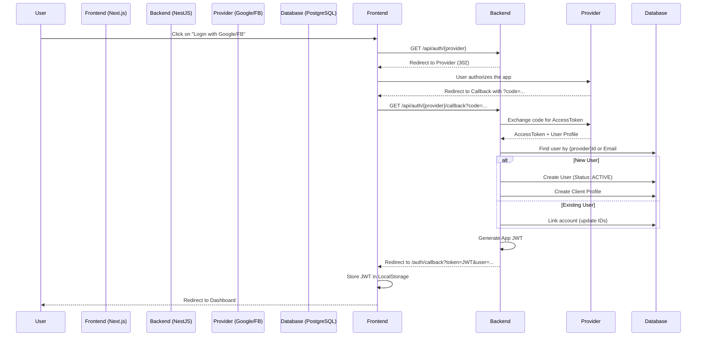

# Social Authentication Architecture (Google & Facebook)

This document details the implementation of social authentication in the "Specialist" application, using OAuth 2.0 with Google and Facebook.

## 1. General Architecture

The implementation follows the **OAuth 2.0 Authorization Code Flow** pattern.



## 2. Data Model Changes (Prisma)

The `User` table was modified to support multiple identity providers and passwordless users.

### Schema (`prisma/schema.prisma`)

```prisma
enum AuthProvider {
  LOCAL
  GOOGLE
  FACEBOOK
}

model User {
  id                String        @id @default(uuid())
  email             String        @unique
  password          String?       // Optional: Social login has no password
  
  // Profile Fields
  firstName         String
  lastName          String
  profilePictureUrl String?
  
  // Social Identifiers (Unique)
  googleId          String?       @unique
  facebookId        String?       @unique
  authProvider      AuthProvider  @default(LOCAL)
  
  status            UserStatus    @default(PENDING)
  // ... other fields
}
```

## 3. Backend Implementation (NestJS)

### Technologies
- **Passport.js**: Authentication middleware.
- **passport-google-oauth20**: Strategy for Google.
- **passport-facebook**: Strategy for Facebook.

### Authentication Strategies

Strategies (`src/user-management/infrastructure/strategies/`) are responsible for normalizing data received from each provider into a common object.

**Google Strategy:**
- Scope: `email`, `profile`
- Mapping: `id` -> `googleId`, `photos[0]` -> `profilePictureUrl`

**Facebook Strategy:**
- Scope: `email`, `public_profile`
- Fields: `id`, `emails`, `name`, `picture.type(large)`
- Mapping: `id` -> `facebookId`

### Authentication Service (`AuthenticationService`)

The core methods are `googleLogin` and `facebookLogin`. Business logic:

1. **Find by Provider ID**: If `googleId` or `facebookId` exists, log in.
2. **Link by Email**: If ID doesn't exist but email does, update user adding the social ID (Account Linking).
3. **Automatic Registration**: If neither exists, create a new user:
   - `password`: null
   - `status`: ACTIVE (emails from trusted providers are considered verified)
   - Automatically create a `Client` profile.

## 4. Frontend Implementation (Next.js)

### Login Page (`app/[locale]/login/page.tsx`)
Direct links to backend endpoints that initiate the OAuth flow:
- Google: `http://localhost:5000/api/auth/google`
- Facebook: `http://localhost:5000/api/auth/facebook`

### Callback Page (`app/[locale]/auth/callback/page.tsx`)
This intermediate page processes the final response from the backend.
1. Reads URL parameters: `token` and `user` (JSON).
2. Stores token in `localStorage` and cookies.
3. Updates global authentication state.
4. Redirects user based on their role (`professional` or `client`).

## 5. Environment Configuration (.env)

### Backend
```env
# Google
GOOGLE_CLIENT_ID=your_client_id
GOOGLE_CLIENT_SECRET=your_client_secret
GOOGLE_CALLBACK_URL=http://localhost:5000/api/auth/google/callback

# Facebook
FACEBOOK_APP_ID=your_app_id
FACEBOOK_APP_SECRET=your_app_secret
FACEBOOK_CALLBACK_URL=http://localhost:5000/api/auth/facebook/callback

# Final Redirect
FRONTEND_URL=http://localhost:3000
```

## 6. Provider Configuration

### Google Cloud Console
1. Create project in Google Cloud.
2. Configure OAuth consent screen (External).
3. Create OAuth 2.0 Web Client credentials.
4. **Authorized Redirect URIs**: `http://localhost:5000/api/auth/google/callback`

### Facebook Developers
1. Create App (Type: Consumer).
2. Add "Facebook Login" product.
3. **Valid OAuth Redirect URIs**: `http://localhost:5000/api/auth/facebook/callback`
4. Basic Settings: Get App ID and Secret.
5. **Note**: In development mode, only "Testers" users can log in.

## 7. Common Troubleshooting

- **Docker DNS Error**: If backend cannot connect to Google/Facebook, ensure container has internet access or use `network_mode: host` in development.
- **Redirect URI Error**: The URL configured in provider console must match **exactly** the backend `CALLBACK_URL`.
- **500 Error on Callback**: Check backend logs. Usually due to DB connection failure or error obtaining token from provider.
